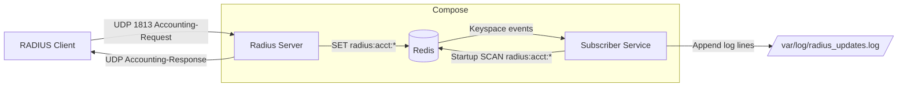

# RADIUS-Accounting-Server

This repository contains a minimal RADIUS Accounting pipeline:
- a Go RADIUS Accounting server that listens for Accounting-Request (UDP 1813), stores accounting records in Redis and responds with Accounting-Response.
- a Redis-backed subscriber that listens for keyspace notifications on `radius:acct:*`, scans for existing keys at startup, and appends timestamped log lines to a persistent logfile.
- Dockerfiles and a `docker-compose.yml` to run the stack locally for testing.

**This README** documents prerequisites, how to run everything (Docker and local), how to test the flow, and common troubleshooting steps.

**Note:** When I refer to files in the repository I use their workspace paths (for example: [docker-compose.yml](docker-compose.yml)).

**Prerequisites**
- Docker (docker.io) and Docker Compose (or `docker compose` plugin) for the containerized workflow.
- Go 1.22+ to build/run local binaries and run tests.

**Quick start — Docker (recommended)**

1. Build and start the stack (from repo root):

```bash
sudo docker-compose up --build -d
```

2. Confirm containers are running:

```bash
sudo docker ps
```

3. Tail the subscriber log directory mounted from the repo (`./logs`):

```bash
tail -f logs/radius_updates.log
```

4. Send a test Accounting-Request from the host (example program included):

```bash
go run send.go
```

After running `send.go` you should see a Redis key `radius:acct:...` (Redis is in the compose stack) and lines appended to `logs/radius_updates.log` by the subscriber.

**Run locally (no Docker)**

1. Ensure Redis is available (e.g. `redis-server` running on `localhost:6379`) or start a local redis for testing.
2. Start the subscriber (writes to `/tmp/radius_updates.log` by default if you export `LOG_FILE`):

```bash
REDIS_ADDR=localhost:6379 LOG_FILE=/tmp/radius_updates.log go run subscriber/main.go
```

3. Start the server (binds UDP 1813 by default):

```bash
RADIUS_SECRET=testing123 REDIS_ADDR=localhost:6379 go run server/main.go
```

4. Send a test Accounting-Request (host or another terminal):

```bash
go run send.go
```

**Run the Go tests**

From the repo root:

```bash
go test ./...
```

The codebase includes an integration-like test for `server` using `miniredis`.

**Files of interest**
- [server/main.go](server/main.go) — RADIUS server implementation.
- [subscriber/main.go](subscriber/main.go) — Redis keyspace-subscriber and startup SCAN.
- [docker-compose.yml](docker-compose.yml) — Compose orchestration for `redis`, `server`, and `subscriber`.
- [redis/redis.conf](redis/redis.conf) — Redis config used in compose (enables `notify-keyspace-events`).
- [send.go](send.go) — small sender program that performs an Accounting-Request to `127.0.0.1:1813`.
- [logs/radius_updates.log](logs/radius_updates.log) — mounted host file where subscriber appends log lines.

**Environment variables**
- `RADIUS_SECRET` — shared secret for RADIUS packets (default in Dockerfile: `testing123`).
- `REDIS_ADDR` — host:port for Redis (Docker uses `redis:6379`).
- `LOG_FILE` — path for subscriber to append logs (Docker container mounts `/var/log` to `./logs`).
- `RADIUS_PORT` — (not yet wired) suggested future env to change bind port.

**Architecture Diagram**



Flow summary:
- `RADIUS Client` sends an `Accounting-Request` to the `Radius Server` on UDP port 1813.
- The `Radius Server` stores a JSON accounting record in Redis under `radius:acct:...` and replies with an `Accounting-Response`.
- Redis is configured to emit keyspace notifications (`notify-keyspace-events`), which the `Subscriber` listens for (PSUBSCRIBE).
- The `Subscriber` also performs a non-destructive `SCAN` at startup to log any existing `radius:acct:*` keys, and appends timestamped lines to the persistent logfile mounted at `/var/log/radius_updates.log`.

This diagram maps to the `docker-compose.yml` services: `server`, `redis`, and `subscriber` running inside the Compose network; the host can run a RADIUS client (e.g. `send.go` or `radclient`) to exercise the flow.

**Troubleshooting**
- Port 6379 in use: if a host Redis is running, it will block the compose `redis` port. Either stop the host service:

```bash
sudo systemctl stop redis-server
```

or change the mapping in [docker-compose.yml](docker-compose.yml) (for example use `63790:6379`).

- Port 1813 in use: if some process is listening on UDP 1813, stop it or kill the PID (example):

```bash
ss -lunp | grep ':1813'
sudo kill <pid>
```

- Subscriber log file permissions: the `logs/` directory is mounted by the subscriber container. If the container cannot write because of ownership, chown on the host:

```bash
sudo chown -R $USER:$USER logs
sudo chmod -R 775 logs
```

- If the subscriber was started after keys were created, it will nevertheless log them at startup because it performs a non-destructive `SCAN` on `radius:acct:*`.
